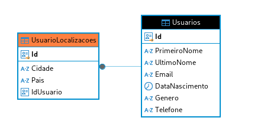

# Usuarios-App

### Prefácio

Esta aplicação permite realizar operações de CRUD para usuários do sistema, armazenando esses dados em um banco de dados PostgreSQL.

### Funcionalidades

- **Cadastro manual de usuário** (informando dados específicos).
- **Cadastro automático de usuário** (dados gerados automaticamente da API pública Random User).
- **Edição de usuário**.
- **Remoção de usuário**.

### Como executar a aplicação

> **Observação:** É necessário ter o Docker instalado na máquina para utilizar a abordagem abaixo.

```bash
docker-compose up --build
```

### Disponibilidade

A aplicação, juntamente com a documentação Swagger, estará disponível em: [http://localhost:5000/swagger/index.html](http://localhost:5000/swagger/index.html)

### Frameworks utilizados

**Entity Framework Core** - Utilizado para gerenciar a criação e manutenção de tabelas por meio de migrações, além de simplificar operações de leitura e escrita no banco de dados. O EF Core permite criar consultas avançadas, buscar registros, e realizar operações CRUD de forma eficiente e integrada com a API, facilitando o desenvolvimento e a manutenção dos dados armazenados.

### Tabelas criadas no banco de dados

| Tabela               | Descrição                                                |
|----------------------|----------------------------------------------------------|
| `Usuarios`           | Armazena informações dos usuários do sistema.            |
| `UsuarioLocalizacoes` | Armazena localizações/endereços associados aos usuários. |

### Endpoints

| Tipo | Rota                         | Descrição                                                     |
|------|-------------------------------|----------------------------------------------------------------|
| GET  | `/api/read/UsuarioRead`       | Lista todos os usuários cadastrados com paginação.             |
| GET  | `/api/read/UsuarioRead/{id}`  | Obtém dados de um usuário específico pelo ID.                  |
| POST | `/api/Usuario`                | Cadastra um novo usuário com dados informados manualmente.     |
| POST | `/api/Usuario/usuarioAleatorio` | Cadastra um novo usuário com dados aleatórios da API Random User. |
| PUT  | `/api/Usuario`                | Atualiza os dados de um usuário existente.                     |
| DELETE | `/api/Usuario/{id}`         | Exclui um usuário específico pelo ID.                          |

### Padrões de projeto utilizados

- **Builder** - Para criação de objetos complexos.
- **Command** - Encapsula uma solicitação como um objeto, permitindo parametrizar objetos com diferentes requisições.

### Objetivo

Criar uma aplicação simples, escalável e fácil de manter, que seja extensível para suportar novas demandas e alterações em regras de negócio.

### Possíveis melhorias para a versão 2.0

- Integrar a API com Prometheus e Grafana para monitoramento de métricas.
- Monitorar o banco de dados com Prometheus e Grafana.
- Implementar testes unitários para todas as camadas, especialmente a camada de domínio, devido à sua lógica de negócios.

## Diagrama de entidades


